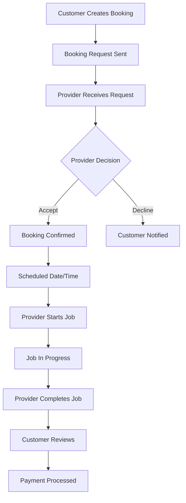

# Clinlix - Application Documentation

## 📋 App Overview

**Clinlix** is a two-sided marketplace platform connecting customers who need cleaning services with professional cleaning service providers. The platform operates in a dual-portal system with separate interfaces for customers and providers.

**Tagline**: "Trusted Cleaning, Every Single Time"

**Languages**: English and Portuguese (pt/en)

---

## 🎯 Core Purpose

Enable seamless booking, scheduling, and management of cleaning services through:
- Real-time job requests and confirmations
- Location-based provider matching
- Transparent pricing and package selection
- Review and rating system
- Wallet and payment management
- Multi-language support

---

## 👥 Portal 1: Customer Portal

### Purpose
Allow customers to book, manage, and review cleaning services.

### Key Features

#### 1. **Home Dashboard**
- Welcome banner with personalized greeting
- Quick action cards:
  - Book a Cleaning
  - My Addresses
  - Payment Methods
  - Profile Settings
- Upcoming bookings carousel
- CTA cards for "How It Works" and "Pricing"
- Unreviewed jobs modal

#### 2. **Booking Flow**
**Path**: `/customer/booking`
- **Step 1**: Address Selection - Choose or add service location
- **Step 2**: Booking Type - Select one-time or recurring service
- **Step 3**: Package & Pricing - Choose cleaning package (basic, standard, premium)
- **Step 4**: Date & Time - Schedule the service
- **Step 5**: Provider Selection - View and select available providers
- **Step 6**: Add-ons - Optional extras (windows, appliances, etc.)
- **Step 7**: Payment - Payment method selection
- **Step 8**: Confirmation - Booking summary and confirmation

#### 3. **My Bookings**
**Path**: `/customer/my-bookings`
- View all bookings (upcoming, in-progress, completed, cancelled)
- Booking status tracking
- Access to booking details
- Review completed bookings

#### 4. **Booking Details**
**Path**: `/customer/booking/:id`
- Complete booking information
- Provider details and contact
- Service status timeline
- Cancel/modify options
- Review and rating interface

#### 5. **Find Providers**
**Path**: `/customer/find-providers`
- Browse available cleaning providers
- Filter by location, rating, availability
- View provider profiles
- Check reviews and ratings

#### 6. **Provider Profiles**
**Path**: `/customer/providers/:id`
- Provider information and photo
- Star ratings and reviews
- Service areas
- Availability calendar
- Book directly with provider

#### 7. **My Addresses**
**Path**: `/customer/my-addresses`
- Manage saved addresses
- Add new locations
- Edit/delete existing addresses
- Set default address

#### 8. **Payment Methods**
**Path**: `/customer/payment-methods`
- Manage payment cards
- Add new payment methods
- Set default payment option
- View payment history

#### 9. **Profile**
**Path**: `/customer/profile`
- Personal information (name, email, phone, country)
- Avatar upload
- Language preference
- Account settings
- Danger zone (delete account)

#### 10. **Additional Pages**
- **How It Works** (`/customer/how-it-works`): Step-by-step guide with images
- **Pricing** (`/customer/pricing`): Pricing packages and 3D hero animation

### Customer Navigation Structure
```
Home (Dashboard)
├── Book Cleaning → Booking Flow
├── My Bookings → List/Details
├── My Addresses → Address Management
└── Profile → Settings & Preferences
```

---

## 🧹 Portal 2: Provider Portal

### Purpose
Allow cleaning service providers to manage job requests, schedules, and earnings.

### Key Features

#### 1. **Provider Dashboard**
**Path**: `/provider/dashboard`
- Welcome banner
- Job statistics overview
- Job requests requiring action
- Confirmed upcoming jobs
- Quick actions (schedule, profile, wallet)
- Recent activity feed

#### 2. **Job Management**
**Path**: `/provider/jobs`

Three main tabs:

##### **Job Requests**
- New incoming booking requests
- Accept/decline functionality
- Request details and customer info
- Response time tracking

##### **Confirmed Jobs**
- Accepted bookings
- Job start/complete buttons
- Job timer for active jobs
- Customer contact information
- Navigation to job location
- Cancel job option

##### **Completed Jobs**
- Historical job records
- Earnings per job
- Customer ratings received
- Job completion dates

#### 3. **Job Details**
**Path**: `/provider/job/:id`
- Complete job information
- Customer details
- Address and navigation
- Job status management
- Start/complete job actions
- Job timer (when active)
- Cancellation option

#### 4. **Schedule Management**
**Path**: `/provider/schedule`
- Calendar view of availability
- Add/edit availability slots
- Date scroller for quick navigation
- Time slot cards
- Block unavailable times
- Recurring availability patterns

#### 5. **Profile Management**
**Path**: `/provider/profile`
- Business information
- Service areas
- Profile photo
- Bio/description
- Verification status
- Accept recurring clients toggle
- Availability status (available/offline)

#### 6. **Reviews**
**Path**: `/provider/reviews`
- All customer reviews
- Star ratings breakdown
- Response to reviews
- Rating statistics

#### 7. **Wallet**
**Path**: `/provider/wallet`
- Earnings overview
- Transaction history
- Payout management
- Payment methods for receiving funds
- Balance tracking

#### 8. **Settings**
**Path**: `/provider/settings`
- Account preferences
- Notification settings
- Language preference
- Availability preferences
- Security settings

### Provider Navigation Structure
```
Dashboard
├── Jobs → Requests/Confirmed/Completed
├── Schedule → Availability Management
├── Reviews → Customer Feedback
├── Wallet → Earnings & Payouts
└── Profile → Business Settings
```

---

## 🔄 Core Workflows

### Booking Lifecycle



### Job Status Flow

1. **pending** - Initial booking created
2. **requested** - Sent to provider
3. **confirmed** - Provider accepted
4. **in_progress** - Job started
5. **completed** - Job finished
6. **cancelled** - Cancelled by either party
7. **reviewed** - Customer left review

---

## 📊 Database Structure

### Core Tables

#### **profiles**
- User profile information
- Role assignment (customer/provider)
- Personal details (name, phone, country)
- Language preference
- Avatar URL

#### **user_roles**
- Role management (customer/provider)
- Multiple role support per user

#### **bookings**
- Booking records
- Customer and provider references
- Address information
- Package and pricing details
- Add-ons selection
- Status tracking
- Timestamps

#### **addresses**
- Customer addresses
- Street, city, postal code, country
- Coordinates (lat/lng)
- Default address flag

#### **provider_availability**
- Provider schedule slots
- Date and time ranges
- Available/blocked status

#### **reviews**
- Customer reviews for providers
- Star ratings
- Review text
- Job reference

#### **notifications**
- Push notifications
- Job updates
- System alerts

#### **password_reset_tokens**
- Password reset functionality
- Token validation
- Expiry tracking

---

## 🌐 Internationalization (i18n)

### Supported Languages
- **English (en)**: Default
- **Portuguese (pt)**: Full translation

### Translation System
- TypeScript-based translation files
- Context-aware translations
- Nested translation keys
- Type-safe translation access

### Translation Coverage
- Navigation labels
- Form labels and placeholders
- Button text
- Status messages
- Error messages
- Success notifications
- Page titles and descriptions

---

## 🎨 Design System

### Color Tokens (HSL-based)
- Primary colors
- Secondary colors
- Accent colors
- Status colors (success, warning, error)
- Neutral shades

### Component Library
- shadcn/ui components
- Custom Clinlix components
- Responsive design patterns
- Mobile-first approach

### Key UI Components
- Action Cards
- Status Badges
- Avatar Display/Uploader
- Language Switcher
- Notification Center
- Job Timer
- Provider Cards
- Date Scroller
- Floating Icon Bar

---

## 📱 Mobile Optimization

### Features
- Progressive Web App (PWA)
- Install prompt
- Offline support
- Service worker
- Responsive layouts
- Touch-optimized interactions
- Bottom tab navigation

### Tab Navigation
- **Customer Tabs**: Home, Book, Bookings, Addresses, Profile
- **Provider Tabs**: Dashboard, Jobs, Schedule, Reviews, Wallet

---

## 🔔 Notifications

### Push Notifications
- Job status updates
- New booking requests
- Payment confirmations
- Review reminders
- System announcements

### Edge Functions
- `send-job-request`
- `send-booking-confirmation`
- `send-booking-accepted`
- `send-booking-cancelled`
- `send-job-started`
- `send-job-completed`
- `notify-job-status-change`
- `send-provider-status-update`
- `send-push-notification`

---

## 🔧 Technical Stack

### Frontend
- React 18
- TypeScript
- Vite
- Tailwind CSS
- shadcn/ui
- React Router v6
- Framer Motion
- React Hook Form
- Zod validation

### Backend (Lovable Cloud)
- Database (PostgreSQL)
- Edge Functions (Deno)
- Storage (File uploads)
- Real-time subscriptions
- Row Level Security (RLS)

### State Management
- React Context API
- TanStack Query
- Local Storage

---

## 🚀 Key Features Summary

### Customer Features
✅ Multi-step booking wizard  
✅ Provider discovery and selection  
✅ Address management  
✅ Payment methods  
✅ Booking history and tracking  
✅ Review and rating system  
✅ Multilingual interface  
✅ Real-time notifications  

### Provider Features
✅ Job request management  
✅ Accept/decline bookings  
✅ Schedule and availability  
✅ Job timer and tracking  
✅ Earnings and wallet  
✅ Customer reviews  
✅ Profile customization  
✅ Push notifications  

### Shared Features
✅ Bilingual support (EN/PT)  
✅ PWA installation  
✅ Responsive design  
✅ Real-time updates  
✅ Secure authentication  
✅ Profile management  
✅ Settings and preferences  

---

## 📈 Future Enhancements (Potential)

- Payment gateway integration (Stripe)
- Advanced search and filters
- Recurring booking automation
- In-app messaging
- Photo verification (before/after)
- Provider team management
- Advanced analytics dashboards
- Referral program
- Loyalty rewards
- Multi-property management for customers

---

**Document Version**: 1.0  
**Last Updated**: 2025-10-30  
**Platform**: Clinlix - Two-Sided Cleaning Marketplace