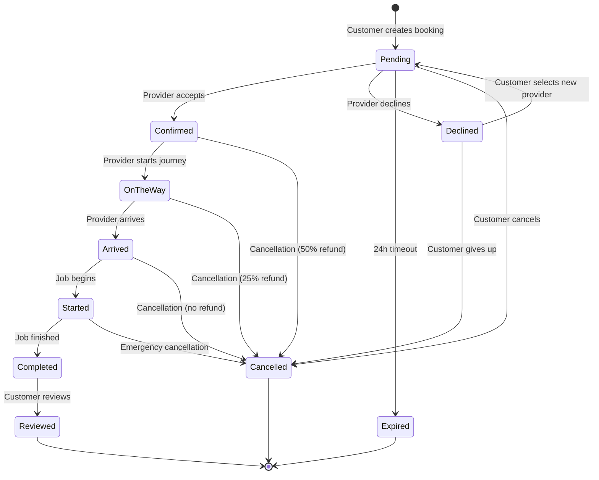

# Booking Workflow Analysis & Recommendations

## Table of Contents
1. [Current Booking Workflow](#current-booking-workflow)
2. [Critical Flaws Identified](#critical-flaws-identified)
3. [Recommendations](#recommendations)
4. [State Transition Diagram](#state-transition-diagram)
5. [Implementation Priorities](#implementation-priorities)

---

## Current Booking Workflow

### Customer Journey (Complete Flow)

#### **Phase 1: Booking Creation**

**Step 1: Location Selection (Where)**
- Customer selects from saved addresses
- System fetches customer addresses with associated cleaning packages
- Validates address ownership via RLS policies
- **Data**: `customer_addresses` with `cleaning_packages` joined

**Step 2: Date & Time Selection (When)**
- Customer selects a date from next 14 days
- Time slots generated (7:00 AM - 7:00 PM, 30-min intervals)
- No validation against provider availability at this stage ⚠️
- **Issue**: Provider availability not checked until next step

**Step 3: Provider Selection (Who)**
- System queries `provider_availability` for selected date
- Displays available providers with:
  - Profile information
  - Rating and review count
  - New provider badge
  - Verified status
- **Flaw**: Customers select provider BEFORE seeing availability

**Step 4: Add-ons Selection**
- Customer selects optional services from `cleaning_addons`
- Add-ons have fixed pricing
- Client-side total calculation (insecure) ⚠️

**Step 5: Payment (Currently Placeholder)**
- Payment integration not implemented
- Stripe toggle present but non-functional
- **Critical Gap**: No payment processing

**Step 6: Review & Confirm**
- Summary displays:
  - Selected address
  - Date, time, provider
  - Package details
  - Add-ons
  - Total cost
- Calls `create-booking` edge function

#### **Phase 2: Booking Processing (Edge Function)**

**`create-booking` Edge Function**
```typescript
Location: supabase/functions/create-booking/index.ts

Process:
1. ✅ Validates authentication
2. ✅ Verifies customer ID matches auth user
3. ✅ Fetches address and validates ownership
4. ✅ Checks provider availability on requested date
5. ✅ Calculates price SERVER-SIDE (secure)
6. ✅ Validates addon IDs exist
7. ✅ Creates booking with status: 'pending'
8. ✅ Sends confirmation emails (customer + provider)

Security: ✅ Strong
```

**Email Notifications Sent:**
- `send-booking-confirmation` → Customer
- `send-job-request` → Provider

#### **Phase 3: Provider Response**

**Provider Views Job Request**
- Location: `JobRequestsList` component
- Displays pending bookings
- Shows customer info, location, package, add-ons, price
- Provider can:
  - View details
  - Accept booking
  - Decline booking

**Provider Accepts Booking**
- Updates `job_status` from `'pending'` → `'confirmed'`
- Updates `confirmed_at` timestamp
- Sends email via `send-booking-accepted` edge function
- **Flaw**: No notification to customer in-app ⚠️

**Provider Declines Booking**
- Updates booking with:
  - `rejected_at` timestamp
  - `rejected_by` user ID
  - `rejection_reason` text
- Sends email via `send-provider-status-update`
- **Critical Flaw**: Booking remains in system, not reassigned ⚠️

#### **Phase 4: Job Execution**

**Job Status Progression**
```
pending → confirmed → on_the_way → arrived → started → completed
```

**Status Updates (via `update-job-status` edge function)**

Validation Rules:
- ✅ Only provider can update their assigned bookings
- ✅ Validates state transitions via `VALID_TRANSITIONS` map
- ✅ Prevents starting jobs before scheduled date
- ✅ Updates timestamps (`confirmed_at`, `started_at`, `completed_at`)
- ✅ Sets `total_final` = `total_estimate` on completion

**Triggers on Status Change:**
- `notify_job_status_change()` database trigger
- Calls `notify-job-status-change` edge function
- Creates in-app notification
- Sends push notification

#### **Phase 5: Job Completion & Payment**

**On Job Completion (`job_status` = 'completed')**
1. `completed_at` timestamp set
2. `total_final` calculated and saved
3. **Database Trigger**: `create_provider_wallet_entry()`
   - Calculates earnings breakdown:
     - Base amount (package price)
     - Addon amount
     - Overtime amount (if any)
     - Platform fee (15%)
     - Payout due (85% of total)
   - Creates record in `provider_wallet`
4. Email sent via `send-job-completed`

**Wallet Entry Creation:**
```sql
INSERT INTO provider_wallet (
  provider_id,
  booking_id,
  base_amount,
  addon_amount,
  overtime_amount,
  total_earned,
  platform_fee,  -- 15%
  payout_due,    -- 85%
  status         -- 'pending'
)
```

#### **Phase 6: Review & Rating**

**Customer Reviews Provider**
- Location: `ReviewBooking` page (route: `/customer/review/:id`)
- Accessible after job completion
- Customer provides:
  - Rating (1-5 stars)
  - Optional comment
- Updates:
  - `provider_reviews` table
  - `bookings.has_review` = true
- **Trigger**: `update_provider_rating()` recalculates provider averages

---

## Critical Flaws Identified

### 🔴 **CRITICAL SEVERITY**

#### 1. **No Payment Integration**
**Location**: Booking flow Phase 1, Step 5
- Payment step is a placeholder
- Bookings created without payment
- **Risk**: Revenue loss, fraudulent bookings
- **Impact**: Business cannot operate
- **Priority**: P0 - URGENT

**Current State:**
```typescript
// src/pages/customer/Booking.tsx (line ~600)
{currentStep === 5 && (
  <Card>
    <CardHeader>
      <CardTitle>Payment</CardTitle>
    </CardHeader>
    <CardContent>
      <p className="text-muted-foreground mb-4">
        Payment integration coming soon
      </p>
      {/* Stripe toggle present but non-functional */}
    </CardContent>
  </Card>
)}
```

**Recommendation**: Integrate Stripe payment with payment intent creation

#### 2. **Declined Bookings Not Reassigned**
**Location**: Provider decline flow
- When provider declines, booking stays declined
- Customer not notified to select another provider
- **Risk**: Lost bookings, poor customer experience
- **Impact**: Revenue loss, customer frustration
- **Priority**: P0 - URGENT

**Current Behavior:**
```typescript
// Provider declines → booking marked as rejected
// No automatic reassignment
// No customer notification to reselect
// Booking essentially abandoned
```

**Recommendation**: Implement booking reassignment workflow

#### 3. **Insecure Client-Side Price Calculation**
**Location**: `src/pages/customer/Booking.tsx` (lines 122-128)
- Total calculated on client before server validation
- Client could manipulate prices before submission
- **Risk**: Price manipulation
- **Impact**: Revenue loss
- **Priority**: P1 - HIGH

**Current Implementation:**
```typescript
const calculateTotal = () => {
  if (!selectedAddress) return 0;
  const basePrice = recurringService 
    ? parseFloat(selectedAddress.cleaning_packages.recurring_price)
    : parseFloat(selectedAddress.cleaning_packages.one_time_price);
  
  const addonTotal = selectedAddons.reduce((sum, addonId) => {
    const addon = addons.find(a => a.id === addonId);
    return sum + (addon ? parseFloat(addon.price) : 0);
  }, 0);
  
  return basePrice + addonTotal;
};
```

**Note**: Edge function DOES recalculate server-side, but client shows manipulable value

### 🟡 **HIGH SEVERITY**

#### 4. **No Real-Time Status Updates**
**Location**: Customer and Provider views
- Status changes not reflected in real-time
- Users must refresh to see updates
- **Risk**: Poor UX, confusion
- **Impact**: User frustration, perceived bugs
- **Priority**: P1 - HIGH

**Missing**: Supabase Realtime subscriptions on `bookings` table

#### 5. **Provider Availability Checked Too Late**
**Location**: Booking flow, Step 2 → Step 3
- Customer selects date/time BEFORE seeing available providers
- Provider might not be available at selected time
- **Risk**: Booking failures, poor UX
- **Impact**: Customer frustration, abandoned bookings
- **Priority**: P1 - HIGH

**Current Flow:**
```
1. Customer selects date/time
2. Customer clicks "Next"
3. System THEN fetches available providers
4. If no providers available → stuck
```

**Better Flow:**
```
1. Customer selects date
2. System shows available time slots (from provider availability)
3. Customer selects provider + time slot combo
```

#### 6. **Incomplete Cancellation Flow**
**Location**: `CancellationDialog` component
- Calculates refund correctly
- Updates booking status to 'cancelled'
- Creates `cancellation_policies` record
- **Missing**: Refund processing
- **Missing**: Provider notification
- **Priority**: P1 - HIGH

**Current Implementation:**
```typescript
// Cancellation recorded but refund not processed
const { error: updateError } = await supabase
  .from('bookings')
  .update({ status: 'cancelled', job_status: 'cancelled' })
  .eq('id', bookingId);

// Refund amount calculated but not executed
const { data: refundData } = await supabase.rpc(
  'calculate_cancellation_refund',
  { p_booking_id: bookingId, p_cancelled_by: user.id }
);
```

### 🟠 **MEDIUM SEVERITY**

#### 7. **No Booking Expiration**
- Pending bookings never expire
- Old requests accumulate
- Provider dashboard cluttered
- **Priority**: P2 - MEDIUM

#### 8. **Limited Error Handling**
**Examples:**
- Network failures during booking creation
- Partial state updates
- Race conditions possible
- **Priority**: P2 - MEDIUM

#### 9. **No Booking Validation Before Scheduled Date**
- Customers can cancel up to service time
- Providers might not be notified in time
- No pre-service confirmation
- **Priority**: P2 - MEDIUM

#### 10. **Messaging Only After Confirmation**
- Customers cannot message providers during pending state
- Cannot ask questions before acceptance
- **Impact**: Communication barriers
- **Priority**: P2 - MEDIUM

### 🟢 **LOW SEVERITY**

#### 11. **No Booking History Filters**
- All bookings shown in single list
- No search functionality
- No date range filters
- **Priority**: P3 - LOW

#### 12. **No Overtime Tracking UI**
- Overtime calculation exists in backend
- No UI for provider to log overtime
- Automatic calculation might be inaccurate
- **Priority**: P3 - LOW

#### 13. **Limited Booking Modification**
- Cannot reschedule bookings
- Cannot modify add-ons after creation
- Must cancel and rebook
- **Priority**: P3 - LOW

---

## Recommendations

### **P0 - URGENT (Implement Immediately)**

#### 1. **Implement Payment Integration**

**Stripe Payment Flow:**

```typescript
// New edge function: create-payment-intent
interface PaymentIntentRequest {
  bookingId: string;
  amount: number; // in cents
  currency: string;
}

// Process:
1. Customer completes booking review
2. Call create-payment-intent edge function
3. Edge function:
   - Validates booking exists and is pending
   - Creates Stripe payment intent
   - Stores payment_intent_id in booking
   - Returns client secret
4. Client-side Stripe Elements handles payment
5. On payment success:
   - Update booking payment_status to 'paid'
   - Proceed with booking confirmation
6. On payment failure:
   - Keep booking in 'pending' state
   - Allow retry
```

**Database Changes:**
```sql
-- Already exists in bookings table:
payment_intent_id TEXT
payment_status TEXT DEFAULT 'pending'

-- Add payment_method_id for future payments
ALTER TABLE bookings ADD COLUMN payment_method_id TEXT;
```

**Implementation Files:**
- New: `supabase/functions/create-payment-intent/index.ts`
- New: `supabase/functions/confirm-payment/index.ts`
- Update: `src/pages/customer/Booking.tsx` (Step 5)
- New: `src/components/booking/PaymentForm.tsx`

#### 2. **Implement Booking Reassignment**

**Automatic Reassignment Flow:**

```typescript
// When provider declines:
1. Mark booking as 'provider_declined'
2. Send notification to customer
3. Present options:
   a. Select different provider (same date/time)
   b. Change date/time
   c. Cancel booking (full refund)
4. If customer doesn't respond within 24h:
   - Auto-cancel with full refund
   - Send email notification
```

**Database Changes:**
```sql
-- Track reassignment attempts
ALTER TABLE bookings ADD COLUMN reassignment_count INTEGER DEFAULT 0;
ALTER TABLE bookings ADD COLUMN last_declined_at TIMESTAMP;

-- New table for decline history
CREATE TABLE booking_decline_history (
  id UUID PRIMARY KEY DEFAULT gen_random_uuid(),
  booking_id UUID REFERENCES bookings(id),
  provider_id UUID REFERENCES provider_profiles(id),
  declined_at TIMESTAMP DEFAULT NOW(),
  reason TEXT
);
```

**Implementation Files:**
- New: `supabase/functions/handle-booking-decline/index.ts`
- New: `src/pages/customer/BookingReassignment.tsx`
- Update: `src/components/provider/QuickAcceptRejectDialog.tsx`

### **P1 - HIGH (Next Sprint)**

#### 3. **Implement Real-Time Updates**

**Enable Realtime on Bookings:**

```sql
-- Enable realtime
ALTER PUBLICATION supabase_realtime ADD TABLE public.bookings;
```

**Client-Side Subscriptions:**

```typescript
// src/hooks/useBookingRealtime.ts
export const useBookingRealtime = (bookingId: string) => {
  useEffect(() => {
    const channel = supabase
      .channel(`booking:${bookingId}`)
      .on(
        'postgres_changes',
        {
          event: 'UPDATE',
          schema: 'public',
          table: 'bookings',
          filter: `id=eq.${bookingId}`
        },
        (payload) => {
          // Update local state
          setBooking(payload.new);
          
          // Show toast notification
          if (payload.new.job_status !== payload.old.job_status) {
            toast.success(`Status updated to ${payload.new.job_status}`);
          }
        }
      )
      .subscribe();
      
    return () => {
      channel.unsubscribe();
    };
  }, [bookingId]);
};
```

**Implementation:**
- Update: `src/pages/customer/MyBookings.tsx`
- Update: `src/pages/customer/BookingDetails.tsx`
- Update: `src/pages/provider/ProviderJobs.tsx`
- Update: `src/pages/provider/JobDetail.tsx`

#### 4. **Improve Provider Availability Flow**

**New Flow:**

```typescript
// Step 1: Select date
// Step 2: Show grid of providers × time slots

interface ProviderTimeSlot {
  providerId: string;
  providerName: string;
  availableSlots: string[]; // ['09:00', '09:30', '10:00']
}

// UI: Grid/matrix view
Provider A: [09:00] [09:30] [10:00] [10:30] ...
Provider B: [09:00] [09:30] [10:00] [10:30] ...
Provider C: [09:00] [09:30] [10:00] [10:30] ...

// Customer selects provider + time in one action
```

**Implementation:**
- New: `src/components/booking/ProviderAvailabilityGrid.tsx`
- Update: `src/pages/customer/Booking.tsx` (combine steps 2 & 3)

#### 5. **Complete Cancellation Flow**

**Process Refunds:**

```typescript
// New edge function: process-cancellation
1. Calculate refund using existing RPC
2. Create Stripe refund
3. Update booking status
4. Create cancellation_policies record
5. Notify provider
6. Send confirmation email to customer
```

**Implementation:**
- New: `supabase/functions/process-cancellation/index.ts`
- Update: `src/components/booking/CancellationDialog.tsx`

### **P2 - MEDIUM (Future Sprints)**

#### 6. **Booking Expiration System**

```typescript
// Database function
CREATE OR REPLACE FUNCTION expire_old_bookings()
RETURNS void AS $$
BEGIN
  UPDATE bookings
  SET 
    status = 'expired',
    job_status = 'expired'
  WHERE 
    job_status = 'pending'
    AND created_at < NOW() - INTERVAL '24 hours';
END;
$$ LANGUAGE plpgsql;

// Cron job (via pg_cron or edge function)
SELECT cron.schedule(
  'expire-bookings',
  '0 * * * *', -- Every hour
  'SELECT expire_old_bookings()'
);
```

#### 7. **Enhanced Error Handling**

**Implement Retry Logic:**

```typescript
// src/lib/bookingService.ts
export const createBookingWithRetry = async (
  bookingData: BookingData,
  maxRetries = 3
) => {
  let lastError;
  
  for (let i = 0; i < maxRetries; i++) {
    try {
      const result = await supabase.functions.invoke('create-booking', {
        body: bookingData
      });
      
      if (result.error) throw result.error;
      return result.data;
    } catch (error) {
      lastError = error;
      if (i < maxRetries - 1) {
        await new Promise(resolve => setTimeout(resolve, 1000 * (i + 1)));
      }
    }
  }
  
  throw lastError;
};
```

#### 8. **Pre-Service Confirmation**

```typescript
// 24 hours before service:
1. Send reminder to customer
2. Request confirmation
3. Notify provider of confirmation status
4. If no confirmation:
   - Send follow-up 12h before
   - Auto-cancel if still no response 6h before
```

### **P3 - LOW (Nice to Have)**

#### 9. **Advanced Filtering & Search**
- Date range filters
- Status filters
- Provider search
- Location search
- Price range filters

#### 10. **Overtime Tracking UI**
- Provider can log actual hours
- Automatic calculation from job timer
- Customer approval for overtime charges

#### 11. **Booking Modification**
- Reschedule date/time
- Add/remove add-ons
- Change provider
- Fee-based modifications

---

## State Transition Diagram



**Legend:**
- Green: Happy path
- Orange: Recovery paths
- Red: Termination paths

---

## Implementation Priorities

### **Sprint 1 (Week 1-2): Critical Fixes**
- [ ] Implement Stripe payment integration
- [ ] Build booking reassignment flow
- [ ] Add payment intent creation edge function
- [ ] Update booking creation to require payment
- [ ] Test end-to-end payment flow

**Deliverables:**
- Functional payment processing
- Automatic booking reassignment on decline
- Payment confirmation emails

### **Sprint 2 (Week 3-4): Real-Time & UX**
- [ ] Enable Supabase Realtime on bookings table
- [ ] Implement real-time status subscriptions
- [ ] Refactor provider availability flow
- [ ] Add provider × time slot grid UI
- [ ] Improve error handling and retries

**Deliverables:**
- Live status updates without refresh
- Better provider selection UX
- Robust error recovery

### **Sprint 3 (Week 5-6): Completion & Polish**
- [ ] Complete cancellation with refund processing
- [ ] Implement booking expiration
- [ ] Add pre-service confirmation
- [ ] Build overtime tracking UI
- [ ] Add booking filters and search

**Deliverables:**
- Full cancellation/refund flow
- Automated booking cleanup
- Enhanced booking management

### **Sprint 4 (Week 7-8): Advanced Features**
- [ ] Booking modification (reschedule)
- [ ] Advanced filtering
- [ ] Analytics dashboard
- [ ] Performance optimization
- [ ] Comprehensive testing

**Deliverables:**
- Feature-complete booking system
- Admin analytics
- Production-ready codebase

---

## Testing Checklist

### **Critical Paths to Test:**

#### Customer Journey
- [ ] Create booking with payment
- [ ] View booking details
- [ ] Cancel booking (test all refund tiers)
- [ ] Receive status notifications
- [ ] Leave review after completion
- [ ] Handle provider decline gracefully

#### Provider Journey
- [ ] View job requests
- [ ] Accept job
- [ ] Decline job with reason
- [ ] Update job status through workflow
- [ ] Complete job and trigger wallet entry
- [ ] View earnings

#### Edge Cases
- [ ] Payment failure recovery
- [ ] Network interruption during booking
- [ ] Concurrent booking attempts
- [ ] Provider becomes unavailable after selection
- [ ] Booking expiration
- [ ] Refund processing failure

#### Security
- [ ] Cannot create booking for another user
- [ ] Cannot modify others' bookings
- [ ] Cannot manipulate prices
- [ ] RLS policies enforced
- [ ] Authentication required for all actions

---

## Conclusion

The current booking system has a **solid foundation** with strong security practices (RLS, server-side validation, secure price calculation). However, it has **critical gaps** that prevent production deployment:

**Blockers:**
1. No payment processing (P0)
2. No booking reassignment (P0)

**Major Issues:**
3. No real-time updates (P1)
4. Poor provider availability UX (P1)
5. Incomplete cancellation flow (P1)

**Recommended Approach:**
1. Fix P0 issues first (payment + reassignment)
2. Implement real-time updates (P1)
3. Improve UX gradually (P1-P3)

**Timeline Estimate:**
- Sprint 1-2 (Critical): 2-4 weeks
- Sprint 3 (Completion): 2 weeks
- Sprint 4 (Polish): 2 weeks
- **Total**: 6-8 weeks to production-ready

**Current Status**: ⚠️ **NOT PRODUCTION READY**
**Target Status**: ✅ **Production Ready** after P0 + P1 completion
