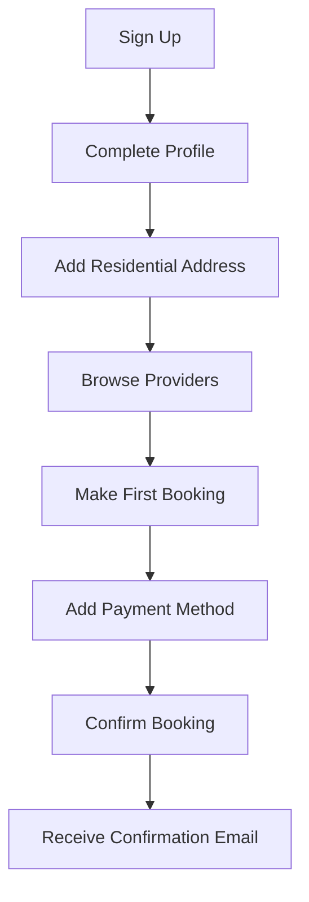
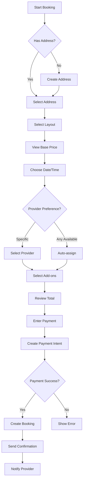
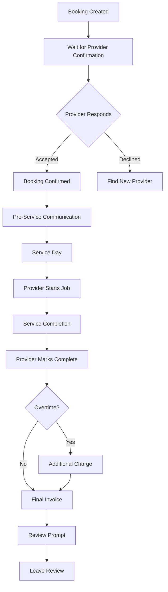
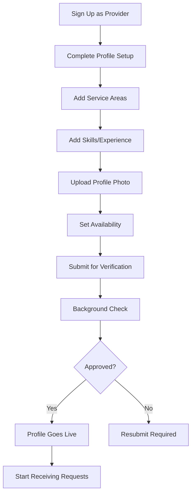
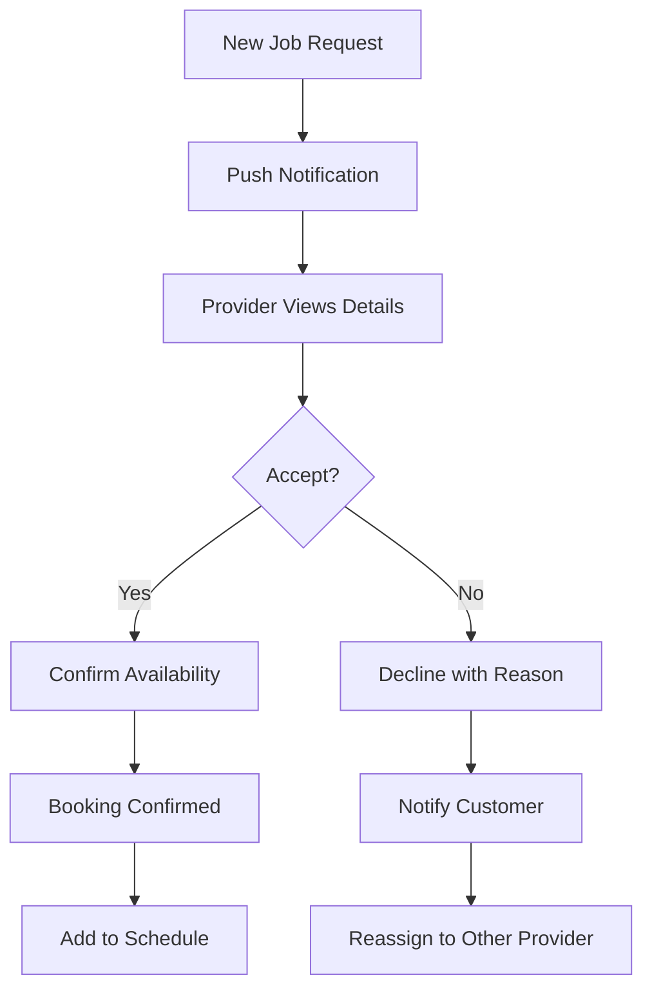
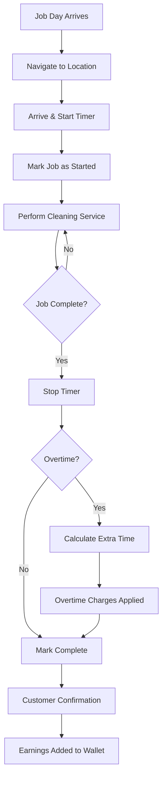

# Provider Profile System - Complete Documentation & Analysis

## Table of Contents
1. [Current System Analysis](#current-system-analysis)
2. [Recommendations & Improvements](#recommendations--improvements)
3. [Customer Portal Documentation](#customer-portal-documentation)
4. [Provider Portal Documentation](#provider-portal-documentation)
5. [Database Schema & Backend Logic](#database-schema--backend-logic)
6. [Pricing System Integration](#pricing-system-integration)
7. [Workflows & User Journeys](#workflows--user-journeys)

---

## 1. Current System Analysis

### 1.1 Public Provider Profile (Customer View)

**File:** `src/pages/ProviderProfile.tsx`

#### Current Features:
- ✅ Avatar display with fallback initials
- ✅ Verified badge for verified providers
- ✅ "NEW" badge for new providers
- ✅ Rating display with stars and review count
- ✅ Tab system (About/Reviews)
- ✅ Skills, service areas, and languages display
- ✅ Bio/description text
- ✅ Fixed "Book Now" button
- ✅ Back navigation

#### Identified Flaws & Issues:

**UI/UX Issues:**
1. **No Loading Skeleton** - Shows spinner instead of content-aware skeleton
2. **No Contact Actions** - Missing quick contact (call, message) buttons
3. **Poor Mobile Optimization** - Fixed positioning might cause issues on different screen sizes
4. **No Gallery** - Only displays single avatar, no portfolio images
5. **Limited Social Proof** - Reviews tab is placeholder only
6. **No Availability Indicator** - Doesn't show if provider is currently available
7. **No Service Pricing Preview** - Customers can't see indicative pricing
8. **Static Bio Display** - No expandable/collapsible long text
9. **Missing Trust Indicators** - No background check, insurance, or certification badges
10. **No Recent Activity** - Doesn't show recent completions or active status

**Technical Issues:**
1. **Weak Type Safety** - Uses `any` for provider state
2. **No Error Handling** - Silent failures in fetch
3. **No Real-time Updates** - Profile changes don't reflect immediately
4. **Missing Analytics** - No tracking of profile views
5. **No SEO Optimization** - Missing meta tags for provider profiles
6. **Hardcoded Values** - Skills and experience have fallback values

**Workflow Issues:**
1. **Single Action** - Only "Book Now", no other engagement options
2. **No Provider Comparison** - Can't compare multiple providers
3. **No Saved Providers** - Can't favorite or save for later
4. **No Direct Messaging** - Must book first to communicate
5. **Missing Booking Context** - Book Now doesn't pre-fill provider

### 1.2 Provider Edit Profile (Provider View)

**File:** `src/pages/provider/ProviderProfilePage.tsx`

#### Current Features:
- ✅ Avatar upload functionality
- ✅ Basic info editing (name, phone, bio)
- ✅ Multi-select for skills
- ✅ Multi-select for service areas
- ✅ Languages selection
- ✅ Experience years input
- ✅ Country selection
- ✅ "View Public Profile" link

#### Identified Flaws & Issues:

**UI/UX Issues:**
1. **Poor Form Organization** - All fields in single long form
2. **No Preview Mode** - Can't see how profile looks to customers
3. **Limited Guidance** - No tips on profile optimization
4. **No Progress Indicator** - Doesn't show profile completeness
5. **Missing Visual Feedback** - Limited validation feedback
6. **No Image Guidelines** - Doesn't specify avatar requirements
7. **Limited Customization** - Can't add portfolio images, certifications
8. **No Analytics Dashboard** - Can't see profile views or engagement

**Technical Issues:**
1. **Inefficient Updates** - Updates multiple tables separately
2. **No Optimistic Updates** - UI doesn't update before server confirmation
3. **Missing Validation** - Minimal client-side validation
4. **No Auto-save** - Risk of losing changes
5. **Poor Error Recovery** - Doesn't specify which update failed

**Workflow Issues:**
1. **No Onboarding Flow** - New providers get no guidance
2. **Missing Verification Status** - Can't see verification progress
3. **No Portfolio Management** - Can't showcase previous work
4. **Limited Availability Control** - Must use separate schedule page

---

## 2. Recommendations & Improvements

### 2.1 Modern Public Profile Design

#### Essential Features:
1. **Hero Section**
   - Large hero banner with provider photo
   - Verified badge prominent display
   - Quick stats (jobs completed, rating, response time)
   - Availability status indicator (Available Now, Busy, Offline)

2. **Quick Action Bar**
   - Book Now (primary CTA)
   - Message (direct chat initiation)
   - Call (if phone provided)
   - Save/Favorite
   - Share profile

3. **Enhanced Information Sections**
   - **About Me** - Expandable bio with rich text
   - **Services & Pricing** - Clear service list with indicative rates
   - **Skills & Certifications** - Visual badges
   - **Service Areas** - Map visualization
   - **Languages** - Flag icons
   - **Reviews & Ratings** - Full review cards with filters
   - **Portfolio** - Image gallery of completed work
   - **Availability Calendar** - Next available slots

4. **Trust Indicators**
   - Background check status
   - Insurance verification
   - Platform tenure
   - Response rate
   - Completion rate
   - Cancellation rate

5. **Social Proof**
   - Featured reviews
   - Total jobs completed
   - Repeat customer rate
   - Average rating trend

#### Mobile-First Design Principles:
- **Touch-Friendly** - Minimum 44px tap targets
- **Thumb-Friendly** - Primary actions in reachable zones
- **Progressive Disclosure** - Show essential info first
- **Swipeable Gallery** - Easy photo browsing
- **Sticky CTA** - Book Now always visible
- **Pull-to-Refresh** - Update profile data
- **Skeleton Loading** - Content-aware placeholders

### 2.2 Modern Provider Edit Profile

#### Essential Features:
1. **Dashboard Overview**
   - Profile completion percentage
   - Profile views analytics
   - Conversion rate (views to bookings)
   - Tips for optimization

2. **Step-by-Step Profile Builder**
   - **Step 1: Basic Info** - Name, avatar, contact
   - **Step 2: Professional Details** - Experience, skills, certifications
   - **Step 3: Service Areas** - Geographic coverage
   - **Step 4: Portfolio** - Upload work samples
   - **Step 5: Pricing** - Service rate guidelines
   - **Step 6: Availability** - Calendar integration

3. **Real-Time Preview**
   - Side-by-side edit/preview
   - Mobile preview mode
   - Desktop preview mode

4. **Smart Features**
   - Auto-save drafts
   - Undo/redo changes
   - Profile strength meter
   - SEO optimization suggestions
   - Competitor insights

5. **Media Management**
   - Avatar upload with crop
   - Portfolio gallery (up to 10 images)
   - Video introduction (optional)
   - Document uploads (certifications)

### 2.3 Technical Architecture Improvements

#### Frontend:
```typescript
// Strongly typed provider interface
interface ProviderProfile {
  id: string;
  userId: string;
  fullName: string;
  firstName: string;
  lastName: string;
  photoUrl?: string;
  coverImageUrl?: string;
  bio: string;
  verified: boolean;
  newProvider: boolean;
  ratingAvg: number;
  ratingCount: number;
  experienceYears: number;
  skills: string[];
  serviceAreas: string[];
  languages: string[];
  certifications?: Certification[];
  portfolio?: PortfolioItem[];
  availability: AvailabilityStatus;
  responseRate: number;
  completionRate: number;
  totalJobsCompleted: number;
  createdAt: string;
  updatedAt: string;
}

interface ProviderStats {
  profileViews: number;
  viewsToBookingRate: number;
  averageResponseTime: number;
  repeatCustomerRate: number;
}
```

#### Backend Enhancements:
1. **Profile Views Tracking**
   - Create `provider_profile_views` table
   - Track unique views per day
   - Aggregate weekly/monthly stats

2. **Provider Search Optimization**
   - Full-text search on bio, skills
   - Geographic radius search
   - Availability-based filtering
   - Rating-based sorting

3. **Real-time Updates**
   - Supabase Realtime for availability
   - Instant profile change reflection
   - Live chat integration

---

## 3. Customer Portal Documentation

### 3.1 Frontend Architecture

#### Key Pages:
1. **Customer Dashboard** (`/customer/dashboard`)
   - Welcome banner with user name
   - Quick actions (Book, Addresses, Payment)
   - Upcoming bookings carousel
   - Notification center
   - How It Works and Pricing CTAs

2. **Find Providers** (`/customer/providers`)
   - Provider grid/list view
   - Filter by location, rating, availability
   - Sort options (rating, price, experience)
   - Provider cards with quick view

3. **Provider Profile** (`/provider-profile/:id`)
   - Detailed provider information
   - Reviews and ratings
   - Book Now action

4. **Booking Flow** (`/customer/booking`)
   - **Step 1:** Select/Create Address
   - **Step 2:** Choose Property Layout
   - **Step 3:** View Pricing
   - **Step 4:** Select Date & Time
   - **Step 5:** Choose Provider
   - **Step 6:** Add-ons Selection
   - **Step 7:** Payment
   - **Step 8:** Confirmation

5. **My Bookings** (`/customer/my-bookings`)
   - Active bookings
   - Past bookings
   - Filter by status
   - Quick actions (cancel, message, review)

6. **Booking Details** (`/customer/booking/:id`)
   - Full booking information
   - Provider contact
   - Location details
   - Service summary
   - Status timeline
   - Chat integration
   - Actions (cancel, reschedule)

7. **My Addresses** (`/customer/my-addresses`)
   - Saved addresses list
   - Add new address
   - Edit/delete addresses
   - Set primary address

8. **Payment Methods** (`/customer/payment-methods`)
   - Saved payment methods
   - Add new card
   - Set default method

9. **Profile Settings** (`/customer/profile`)
   - Personal information
   - Contact details
   - Residential address
   - Preferences

10. **Review Booking** (`/customer/review/:bookingId`)
    - Rate provider (1-5 stars)
    - Write review comment
    - Submit feedback

### 3.2 Customer Workflows

#### A. New Customer Onboarding


#### B. Booking Creation Workflow


#### C. Post-Booking Customer Journey


### 3.3 Customer Backend Logic

#### Authentication & Authorization
- **Sign Up:** Email/password with metadata (first_name, last_name, role)
- **Profile Creation:** Automatic via `handle_new_user()` trigger
- **Role Enforcement:** RLS policies ensure customer can only access own data

#### Booking Creation Process
**Edge Function:** `create-booking`

**Steps:**
1. **Authenticate User** - Verify JWT token
2. **Validate Payment** - Check Stripe payment intent
3. **Fetch Address** - Get customer address details
4. **Fetch Package** - Get pricing from `cleaning_packages`
5. **Calculate Add-ons** - Sum prices from `cleaning_addons`
6. **Calculate Total Estimate** - Base + Add-ons
7. **Verify Provider Availability** - Check `provider_availability`
8. **Create Booking Record** - Insert into `bookings` table
9. **Send Notifications** - Email to customer & provider
10. **Return Booking ID** - Redirect to booking details

**Server-Side Validation:**
```typescript
// Verify prices match database
const packagePrice = await getPackagePrice(packageId);
const addonTotal = await getAddonsTotal(addonIds);
const serverTotal = packagePrice + addonTotal;

if (Math.abs(serverTotal - clientTotal) > 0.01) {
  throw new Error('Price mismatch detected');
}
```

#### Booking Status Transitions
```
Customer Actions:
- pending → cancelled (customer cancellation)
- confirmed → cancelled (customer cancellation with policy)
- completed → reviewed (after leaving review)

Automatic Transitions:
- pending → expired (after 24h no provider acceptance)
```

#### Payment Integration
**Stripe Payment Intent Flow:**
1. Customer enters card details
2. Frontend creates payment intent via `create-payment-intent` edge function
3. Stripe processes payment
4. Booking created with `payment_intent_id`
5. On job completion, payment captured
6. Overtime charges processed separately if applicable

---

## 4. Provider Portal Documentation

### 4.1 Frontend Architecture

#### Key Pages:
1. **Provider Dashboard** (`/provider/dashboard`)
   - Earnings summary
   - Pending job requests
   - Today's schedule
   - Quick stats (rating, jobs completed)

2. **Jobs** (`/provider/jobs`)
   - **Tabs:** Requests, Confirmed, Completed
   - Job cards with quick actions
   - Filter by date, status
   - Accept/decline requests

3. **Job Details** (`/provider/job/:id`)
   - Customer information
   - Service location (with map)
   - Service requirements
   - Pricing breakdown
   - Chat with customer
   - Job actions (start, complete, cancel)
   - Timer for tracking duration

4. **Schedule** (`/provider/schedule`)
   - Calendar view
   - Add availability slots
   - View confirmed bookings
   - Block off time

5. **Profile** (`/provider/profile`)
   - Edit profile information
   - Upload avatar
   - Manage skills & service areas
   - View public profile

6. **Wallet** (`/provider/wallet`)
   - Earnings history
   - Pending payouts
   - Transaction details
   - Earnings breakdown (base, addons, overtime)

7. **Reviews** (`/provider/reviews`)
   - All reviews received
   - Average rating
   - Response to reviews (future feature)

8. **Settings** (`/provider/settings`)
   - Notification preferences
   - Availability status
   - Account settings

### 4.2 Provider Workflows

#### A. Provider Onboarding


#### B. Job Request Handling


#### C. Job Execution Flow


### 4.3 Provider Backend Logic

#### Job Status Management
**Edge Function:** `update-job-status`

**Valid Transitions:**
```typescript
const VALID_TRANSITIONS = {
  pending: ['confirmed', 'declined'],
  confirmed: ['started', 'cancelled'],
  started: ['completed'],
  completed: [], // terminal state
  declined: [], // terminal state
  cancelled: [], // terminal state
};
```

**Status Update Process:**
1. **Authenticate Provider** - Verify JWT
2. **Fetch Current Booking** - Get booking from database
3. **Verify Provider Ownership** - Ensure provider assigned to booking
4. **Validate Transition** - Check against VALID_TRANSITIONS
5. **Prevent Early Start** - Block starting before scheduled date
6. **Update Timestamps** - Set started_at, completed_at, etc.
7. **Calculate Overtime** - If completed, calculate minutes over base time
8. **Trigger Notifications** - Edge function `notify-job-status-change`
9. **Update Wallet** - Trigger `create_provider_wallet_entry()` on completion

#### Overtime Calculation
**Rules:**
- Base package includes specific hours (e.g., "3 hours")
- Overtime tracked in 30-minute increments
- Pricing: €10 per 30min (EUR), $15 per 30min (CAD)
- Rounding: Always round up to next increment

**Logic:**
```typescript
// Calculate overtime
const baseMinutes = getPackageTimeInMinutes(packageId); // e.g., 180
const actualMinutes = calculateActualDuration(startedAt, completedAt);
const overtimeMinutes = Math.max(0, actualMinutes - baseMinutes);

// Round up to next 30-min increment
const roundedOvertime = Math.ceil(overtimeMinutes / 30) * 30;

// Calculate charge based on currency
const currency = booking.customer.currency;
const rate = currency === 'EUR' ? 10 : 15;
const overtimeCharge = (roundedOvertime / 30) * rate;

// Update booking
await supabase
  .from('bookings')
  .update({
    overtime_minutes: roundedOvertime,
    total_final: total_estimate + overtimeCharge,
    job_status: 'completed',
    completed_at: new Date().toISOString()
  })
  .eq('id', bookingId);
```

#### Earnings Calculation
**Database Trigger:** `create_provider_wallet_entry()`

**Executed:** When `job_status` changes to 'completed'

**Calculation:**
```sql
-- Get base package price
package_price = (SELECT one_time_price FROM cleaning_packages WHERE id = package_id)

-- Calculate addon total
addon_total = (SELECT SUM(price) FROM cleaning_addons WHERE id = ANY(addon_ids))

-- Get overtime amount
overtime_amount = (overtime_minutes / 30) * rate_per_increment

-- Calculate totals
total_earned = package_price + addon_total + overtime_amount
platform_fee = total_earned * 0.15  -- 15% commission
payout_due = total_earned - platform_fee

-- Insert wallet entry
INSERT INTO provider_wallet (
  provider_id, booking_id, base_amount, addon_amount, 
  overtime_amount, total_earned, platform_fee, payout_due, status
) VALUES (...)
```

#### Availability Management
**Table:** `provider_availability`

**Operations:**
- **Add Slot:** Provider specifies date, start_time, end_time
- **View Availability:** Calendar displays all slots
- **Delete Slot:** Remove availability
- **Conflict Detection:** Prevent overlapping bookings

**RLS Policy:**
- Providers can manage own availability
- Anyone can view availability (for booking matching)

---

## 5. Database Schema & Backend Logic

### 5.1 Core Tables

#### `profiles`
**Purpose:** Store user profile information for both customers and providers

**Key Columns:**
- `id` (uuid, PK) - Matches auth.users.id
- `role` (enum: customer/provider) - User type
- `first_name`, `last_name` - User name
- `email` - Contact email
- `phone` - Contact phone
- `avatar_url` - Profile picture
- `gender`, `date_of_birth` - Demographics
- `residential_*` - Home address fields
- `country`, `currency`, `language` - Localization
- `notifications_enabled`, `sms_notifications` - Preferences
- `available_status` (provider only) - Online/offline
- `accept_recurring` (provider only) - Accepts recurring jobs

**RLS Policies:**
- Users can view/update own profile
- Providers can view customer profiles for assigned jobs

#### `provider_profiles`
**Purpose:** Extended profile for service providers

**Key Columns:**
- `id` (uuid, PK)
- `user_id` (uuid, FK → profiles.id) - Links to main profile
- `full_name` - Display name
- `photo_url` - Avatar
- `bio` - About me text
- `skills` (text[]) - Services offered
- `service_areas` (text[]) - Geographic coverage
- `languages` (text[]) - Languages spoken
- `experience_years` - Years of experience
- `verified` - Platform verification status
- `new_provider` - Recently joined
- `rating_avg` - Average rating (auto-calculated)
- `rating_count` - Total reviews (auto-calculated)

**RLS Policies:**
- Anyone can view provider profiles
- Providers can update own profile

#### `bookings`
**Purpose:** Service booking records

**Key Columns:**
- `id` (uuid, PK)
- `customer_id` (uuid, FK → profiles.id)
- `provider_id` (uuid, FK → provider_profiles.id)
- `address_id` (uuid, FK → customer_addresses.id)
- `package_id` (uuid, FK → cleaning_packages.id)
- `addon_ids` (uuid[]) - Selected add-on services
- `requested_date`, `requested_time` - When service scheduled
- `status` - Booking lifecycle (pending/confirmed/cancelled/completed)
- `job_status` - Provider job tracking (pending/confirmed/started/completed)
- `payment_status` - Payment state (pending/succeeded/failed)
- `payment_intent_id` - Stripe payment reference
- `total_estimate` - Initial quoted price
- `total_final` - Final price with overtime
- `overtime_minutes` - Extra time worked
- `started_at`, `completed_at`, `confirmed_at` - Timestamps
- `rejected_at`, `declined_at` - Rejection tracking
- `has_review` - Review submitted flag

**RLS Policies:**
- Customers can create and view own bookings
- Providers can view and update assigned bookings

#### `customer_addresses`
**Purpose:** Customer service locations

**Key Columns:**
- `id` (uuid, PK)
- `customer_id` (uuid, FK → profiles.id)
- `label` - Address nickname (e.g., "Home", "Office")
- `first_name`, `last_name`, `email`, `phone` - Contact info
- `country`, `currency` - Location data
- `property_type` - House/Apartment/etc
- `layout_type` - Bedroom count (STUDIO/1BR/2BR/3BR/4BR)
- `package_code` - Auto-assigned package
- Portugal fields: `rua`, `codigo_postal`, `localidade`, `distrito`, `porta_andar`
- Canada fields: `street`, `apt_unit`, `city`, `province`, `postal_code`
- `is_primary` - Default address flag

**RLS Policies:**
- Users can manage own addresses
- Providers can view addresses for assigned jobs

#### `cleaning_packages`
**Purpose:** Service pricing tiers

**Key Columns:**
- `id` (uuid, PK)
- `package_code` - Unique identifier (e.g., "STUDIO", "1BR")
- `package_name` - Display name
- `bedroom_count` - Number of bedrooms
- `one_time_price` - Single service cost
- `recurring_price` - Subscription cost
- `time_included` - Base hours (e.g., "3 hours")
- `areas_included` - Default cleaning areas

**RLS Policies:**
- Read-only for all users

#### `cleaning_addons`
**Purpose:** Optional add-on services

**Key Columns:**
- `id` (uuid, PK)
- `type` - Category (e.g., "appliance", "laundry")
- `name_en`, `name_pt` - Multi-language names
- `price` - Additional cost

**RLS Policies:**
- Read-only for all users

#### `overtime_rules`
**Purpose:** Overtime pricing configuration

**Key Columns:**
- `id` (uuid, PK)
- `increment_minutes` - Billing increment (30)
- `price_eur` - Rate in euros (€10)
- `price_cad` - Rate in CAD ($15)

**RLS Policies:**
- Read-only for all users

#### `provider_wallet`
**Purpose:** Provider earnings tracking

**Key Columns:**
- `id` (uuid, PK)
- `provider_id` (uuid, FK → provider_profiles.id)
- `booking_id` (uuid, FK → bookings.id)
- `base_amount` - Package price
- `addon_amount` - Add-ons total
- `overtime_amount` - Overtime earnings
- `total_earned` - Gross earnings
- `platform_fee` - 15% commission
- `payout_due` - Net payout (total - fee)
- `status` - Payment status (pending/paid)

**RLS Policies:**
- Providers can view own wallet
- Read-only (auto-generated by trigger)

#### `provider_reviews`
**Purpose:** Customer feedback on providers

**Key Columns:**
- `id` (uuid, PK)
- `provider_id` (uuid, FK → provider_profiles.id)
- `customer_id` (uuid, FK → profiles.id)
- `booking_id` (uuid, FK → bookings.id) - One review per booking
- `rating` - 1-5 stars
- `comment` - Review text

**RLS Policies:**
- Anyone can read reviews
- Customers can create review for completed bookings

**Triggers:**
- `update_provider_rating()` - Recalculates provider's avg rating

#### `messages`
**Purpose:** In-app chat between customers and providers

**Key Columns:**
- `id` (uuid, PK)
- `booking_id` (uuid, FK → bookings.id)
- `sender_id` (uuid) - Message author
- `content` - Message text
- `read_status` - Seen flag

**RLS Policies:**
- Users can view messages for their bookings
- Users can send messages for their bookings

**Triggers:**
- `notify_new_message()` - Sends push notification

### 5.2 Database Functions

#### `handle_new_user()`
**Trigger:** AFTER INSERT on `auth.users`
**Purpose:** Auto-create profile when user signs up

**Logic:**
1. Extract role from metadata (default: customer)
2. Parse first_name/last_name from metadata
3. Insert into `profiles` table
4. Insert into `user_roles` table
5. If provider, create `provider_profiles` entry

#### `update_provider_rating()`
**Trigger:** AFTER INSERT on `provider_reviews`
**Purpose:** Update provider's average rating

**Logic:**
1. Calculate new average from all reviews
2. Count total reviews
3. Update `provider_profiles` rating fields

#### `create_provider_wallet_entry()`
**Trigger:** AFTER UPDATE on `bookings` (when job_status → completed)
**Purpose:** Generate earnings record

**Logic:**
1. Fetch package price
2. Sum addon prices
3. Calculate overtime amount
4. Compute totals and platform fee
5. Insert into `provider_wallet`

#### `validate_booking_timestamps()`
**Trigger:** BEFORE INSERT/UPDATE on `bookings`
**Purpose:** Ensure logical timestamp order

**Logic:**
1. Check started_at ≥ created_at
2. Check completed_at ≥ started_at
3. Raise exception if invalid

#### `notify_job_status_change()`
**Trigger:** AFTER UPDATE on `bookings` (when job_status changes)
**Purpose:** Send notifications on status updates

**Logic:**
1. Call edge function `notify-job-status-change`
2. Pass booking ID and status change
3. Edge function sends emails/push notifications

---

## 6. Pricing System Integration

### 6.1 Base Package Pricing

**Determination Logic:**
```
Customer selects:
→ Country (Portugal/Canada)
→ Property Type (House/Apartment/Condo)
→ Layout (STUDIO/1BR/2BR/3BR/4BR)

System auto-assigns:
→ package_code based on layout
→ currency based on country
→ one_time_price or recurring_price
```

**Example Pricing:**
| Package | Bedrooms | One-Time (EUR) | Recurring (EUR) | Time Included |
|---------|----------|----------------|-----------------|---------------|
| STUDIO  | 0        | €79            | €69             | 2.5 hours     |
| 1BR     | 1        | €99            | €89             | 3 hours       |
| 2BR     | 2        | €129           | €115            | 3.5 hours     |
| 3BR     | 3        | €159           | €145            | 4 hours       |
| 4BR     | 4        | €199           | €179            | 5 hours       |

### 6.2 Add-On Pricing

**Selection Process:**
1. Customer views available add-ons
2. Multi-select desired services
3. Total dynamically updates
4. Add-on IDs stored in `bookings.addon_ids`

**Example Add-Ons:**
| Service                | Type       | Price |
|------------------------|------------|-------|
| Inside Fridge          | appliance  | €15   |
| Inside Oven            | appliance  | €20   |
| Laundry Wash & Fold    | laundry    | €25   |
| Ironing (per item)     | laundry    | €3    |
| Deep Clean             | extra      | €40   |

**Calculation:**
```typescript
const addonTotal = selectedAddons.reduce((sum, addon) => sum + addon.price, 0);
```

### 6.3 Overtime Pricing

**Calculation Process:**
1. Provider marks job complete
2. System calculates actual duration: `completed_at - started_at`
3. Compare to package `time_included`
4. If over, calculate overtime:
   ```
   overtime_minutes = actual_minutes - base_minutes
   rounded_overtime = CEIL(overtime_minutes / 30) * 30
   overtime_charge = (rounded_overtime / 30) * rate
   ```
5. Rate depends on currency:
   - EUR: €10 per 30 minutes
   - CAD: $15 per 30 minutes

**Example:**
- Package: 2BR (3.5 hours = 210 minutes)
- Actual duration: 4 hours 15 minutes = 255 minutes
- Overtime: 255 - 210 = 45 minutes
- Rounded: CEIL(45/30) * 30 = 60 minutes (2 increments)
- Charge: 2 * €10 = €20

### 6.4 Total Price Calculation

**Initial Estimate (Booking Creation):**
```
total_estimate = base_package_price + addon_total
```

**Final Total (Job Completion):**
```
total_final = total_estimate + overtime_charge
```

**Payment Flow:**
1. Customer pays `total_estimate` upfront via Stripe
2. Payment held (authorized but not captured)
3. On job completion, final amount calculated
4. If overtime: additional charge processed
5. Final amount captured

### 6.5 Provider Earnings

**Commission Structure:**
- Platform Fee: 15% of total earnings
- Provider receives: 85% of total

**Breakdown:**
```
base_amount = package_price
addon_amount = sum(addon_prices)
overtime_amount = overtime_charge
total_earned = base + addon + overtime
platform_fee = total_earned * 0.15
payout_due = total_earned - platform_fee
```

**Example:**
- Base Package: €129 (2BR)
- Add-ons: €35 (Fridge + Oven)
- Overtime: €20 (60 minutes over)
- **Total Earned:** €184
- **Platform Fee:** €27.60 (15%)
- **Provider Payout:** €156.40

---

## 7. Workflows & User Journeys

### 7.1 Customer Journey Map

#### Discovery Phase
1. **Landing Page** - Learn about service
2. **Pricing Page** - Understand costs
3. **How It Works** - See process
4. **Browse Providers** - View available cleaners
5. **Provider Profiles** - Check reviews and details

#### Decision Phase
6. **Sign Up** - Create account
7. **Complete Profile** - Add personal info
8. **Add Address** - Save service location
9. **Select Package** - Choose based on home size
10. **View Pricing** - See total estimate

#### Booking Phase
11. **Choose Date/Time** - Pick slot
12. **Select Provider** - Specific or any
13. **Add Extras** - Optional add-ons
14. **Review Total** - Final price check
15. **Payment** - Enter card details
16. **Confirmation** - Booking created

#### Service Phase
17. **Wait for Acceptance** - Provider confirms
18. **Pre-Service Chat** - Communicate details
19. **Service Day** - Provider arrives
20. **In Progress** - Cleaning performed
21. **Completion** - Job finished

#### Post-Service Phase
22. **Final Invoice** - See charges (+ overtime if any)
23. **Review Prompt** - Rate provider
24. **Leave Feedback** - Write review
25. **Rebook** - Use service again

### 7.2 Provider Journey Map

#### Onboarding Phase
1. **Sign Up** - Register as provider
2. **Profile Setup** - Add bio, photo, skills
3. **Service Areas** - Define coverage
4. **Availability** - Set schedule
5. **Verification** - Background check (future)
6. **Go Live** - Profile active

#### Job Acquisition Phase
7. **Receive Request** - New booking notification
8. **Review Details** - Check job info
9. **Accept/Decline** - Respond to request
10. **Confirmation** - Customer notified

#### Preparation Phase
11. **View Schedule** - Check calendar
12. **Customer Chat** - Clarify details
13. **Navigation** - Get directions
14. **Arrival** - Reach location

#### Service Phase
15. **Start Job** - Begin timer
16. **Perform Service** - Execute cleaning
17. **Complete Job** - Finish and stop timer
18. **Overtime Logging** - Auto-calculated

#### Post-Service Phase
19. **Earnings Update** - Wallet credited
20. **Review Received** - Customer feedback
21. **Payout** - Transfer to bank (future)

### 7.3 Booking State Machine

```
States:
┌──────────┐
│ pending  │ ← Initial state when booking created
└────┬─────┘
     │
     ├─→ confirmed (provider accepts)
     │
     ├─→ declined (provider declines)
     │
     └─→ cancelled (customer cancels before acceptance)

┌──────────┐
│confirmed │
└────┬─────┘
     │
     ├─→ started (provider arrives and starts)
     │
     └─→ cancelled (customer/provider cancels)

┌─────────┐
│ started │
└────┬────┘
     │
     └─→ completed (provider finishes)

┌───────────┐
│ completed │ ← Terminal state
└───────────┘
```

### 7.4 Notification Triggers

#### Customer Notifications:
- **Booking Created** - Confirmation email
- **Provider Assigned** - Provider accepted job
- **Provider Declined** - Need to reassign
- **Job Started** - Provider on way
- **Job Completed** - Service finished
- **Review Reminder** - 24h after completion
- **Booking Cancelled** - Cancellation notice

#### Provider Notifications:
- **New Job Request** - Push + email
- **Job Cancelled** - Customer cancelled
- **Message Received** - Customer sent message
- **Review Received** - Customer left review
- **Payout Processed** - Earnings transferred

### 7.5 Error Handling & Edge Cases

#### Customer-Side:
1. **No Available Providers** - Show message, save as pending request
2. **Payment Failed** - Retry or use different card
3. **Address Geocoding Failed** - Manual entry fallback
4. **Provider No-Show** - Auto-cancel and refund
5. **Dissatisfied with Service** - Dispute process

#### Provider-Side:
1. **Double-Booking** - Prevent via availability check
2. **Emergency Cancellation** - Allow with notification
3. **Customer Not Home** - Report and get paid for time
4. **Unsafe Environment** - Cancel without penalty
5. **Payment Dispute** - Platform mediation

---

## 8. Proposed New Implementation

### 8.1 Public Profile Component Architecture

```
src/pages/provider/
  PublicProviderProfile.tsx       ← Main public profile page
  components/
    ProfileHero.tsx               ← Header with photo, name, badges
    QuickActionBar.tsx            ← Book, Message, Call, Share buttons
    AboutSection.tsx              ← Bio and description
    ServicesSection.tsx           ← Skills with visual badges
    AvailabilityCalendar.tsx      ← Next available slots
    ReviewsSection.tsx            ← Customer reviews with filters
    PortfolioGallery.tsx          ← Work samples carousel
    TrustIndicators.tsx           ← Verification badges
    StatsOverview.tsx             ← Jobs completed, response time, etc.
```

### 8.2 Provider Edit Profile Architecture

```
src/pages/provider/
  EditProviderProfile.tsx         ← Main edit page
  components/
    ProfileCompletionMeter.tsx    ← Progress indicator
    BasicInfoStep.tsx             ← Name, avatar, contact
    ProfessionalDetailsStep.tsx   ← Experience, skills, certs
    ServiceAreasStep.tsx          ← Geographic coverage
    PortfolioStep.tsx             ← Upload work images
    PricingStep.tsx               ← Service rates (future)
    ProfilePreview.tsx            ← Real-time preview pane
    MediaUploader.tsx             ← Drag-drop file upload
```

### 8.3 Mobile-First Design Patterns

**Touch Targets:**
- Minimum 44x44px for all interactive elements
- Spacing between interactive elements ≥ 8px

**Gestures:**
- Swipe left/right for gallery navigation
- Pull-to-refresh for data updates
- Long-press for additional options

**Layout:**
- Single column on mobile (<768px)
- Two columns on tablet (768px-1024px)
- Three columns on desktop (>1024px)

**Performance:**
- Lazy load images below fold
- Skeleton screens for loading states
- Optimistic UI updates
- Service worker for offline capability

### 8.4 Accessibility Features

- **ARIA Labels** - Screen reader support
- **Keyboard Navigation** - Full keyboard access
- **Focus Indicators** - Clear focus states
- **Color Contrast** - WCAG AA compliance
- **Alt Text** - All images described
- **Semantic HTML** - Proper heading hierarchy

---

## 9. Implementation Roadmap

### Phase 1: Foundation (Week 1-2)
- [ ] Create strongly typed interfaces
- [ ] Build reusable profile components
- [ ] Implement skeleton loading states
- [ ] Set up analytics tracking

### Phase 2: Public Profile (Week 3-4)
- [ ] Modern profile hero section
- [ ] Quick action bar
- [ ] Enhanced about section
- [ ] Reviews section with filters
- [ ] Portfolio gallery
- [ ] Trust indicators
- [ ] Mobile optimization

### Phase 3: Provider Edit (Week 5-6)
- [ ] Profile completion meter
- [ ] Step-by-step builder
- [ ] Real-time preview
- [ ] Media upload (avatar + portfolio)
- [ ] Auto-save functionality
- [ ] Validation and error handling

### Phase 4: Advanced Features (Week 7-8)
- [ ] Provider search optimization
- [ ] Profile view tracking
- [ ] Availability calendar integration
- [ ] Direct messaging
- [ ] Social sharing
- [ ] SEO optimization

### Phase 5: Polish & Testing (Week 9-10)
- [ ] Cross-browser testing
- [ ] Mobile device testing
- [ ] Performance optimization
- [ ] Accessibility audit
- [ ] User acceptance testing
- [ ] Documentation

---

## 10. Success Metrics

### Customer-Side:
- **Profile View to Booking Rate** - % of profile views that result in bookings
- **Average Time on Profile** - Engagement indicator
- **Favorite/Save Rate** - Profile appeal
- **Direct Message Rate** - Communication engagement

### Provider-Side:
- **Profile Completion Rate** - % of providers with 100% complete profiles
- **Profile Update Frequency** - How often providers improve their profiles
- **Response Time** - How quickly providers accept/decline
- **Customer Satisfaction** - Average rating received

### Platform-Wide:
- **Provider Discovery Rate** - % of customers who find providers via browse
- **Repeat Booking Rate** - Same provider rebooked
- **Average Booking Value** - Impact of better profiles on pricing
- **Cancellation Rate** - Lower cancellations with better matching

---

## 11. Security & Privacy

### Customer Data Protection:
- **Personal Info** - Never shared publicly
- **Address** - Only visible to assigned provider after acceptance
- **Payment Info** - Handled entirely by Stripe, never stored
- **Phone/Email** - Hidden until booking confirmed

### Provider Data Protection:
- **Background Checks** - Stored securely, displayed as badge only
- **Earnings** - Private to provider
- **Availability** - Publicly visible for matching
- **Reviews** - Public but moderated

### RLS Enforcement:
- All database access controlled by Row-Level Security
- Providers can only see own earnings
- Customers can only see own bookings
- Messages restricted to booking participants

---

## Conclusion

This documentation provides a complete overview of the Clinlix platform's customer and provider portals, including:

✅ **Current State Analysis** - Identified flaws and improvement areas
✅ **Recommendations** - Modern UI/UX patterns and mobile-first design
✅ **Frontend Architecture** - Complete page structure and component breakdown
✅ **Backend Logic** - Database schema, triggers, edge functions
✅ **Pricing System** - Package, add-on, and overtime calculations
✅ **Workflows** - End-to-end user journeys
✅ **Implementation Plan** - Phased roadmap with timelines

**Next Steps:**
1. Review and approve proposed designs
2. Prioritize features based on business goals
3. Begin implementation following roadmap
4. Iterate based on user feedback

**Key Differentiators:**
- **Mobile-First** - Optimized for on-the-go usage
- **Trust-Focused** - Verification and reviews prominent
- **Transparent Pricing** - Clear breakdown at every step
- **Real-Time Updates** - Live status and availability
- **Smart Matching** - Algorithm-based provider recommendations
